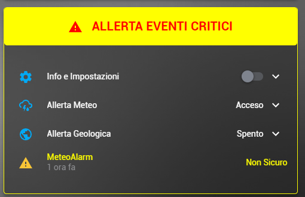
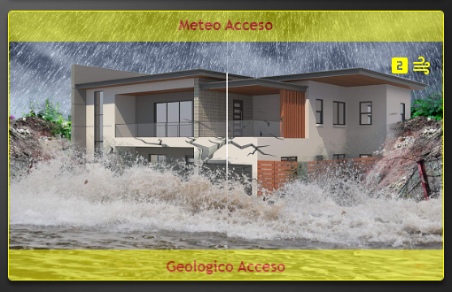

# Package-Natural-Events

Guide [Natural Events](https://hassiohelp.eu/2019/10/06/package-eventi-naturali/)

# EXTRA

## [My Package](./extra/my_pkg_natural_events_CN.yaml)

## [My Lovelace Card](./extra/card_natural_events.yaml)

  

## [My Lovelace Card Picture Element](./extra/card_natural_events_picture.yaml)

  
Custom Cards: card-mod, button-entity-row, fold-entity-row

## [My Lovelace Card Picture Element Menu](./extra/card_natural_events.yaml)
